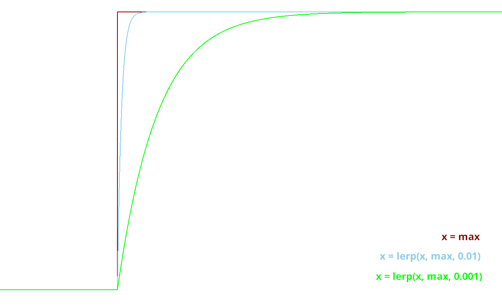

Animation du personage
======================

Actuellement, notre personage bouge, mais il reste toujours statiquement dans la même frame de la même animation.
Il est temps de changer ça !

Lancement de l'animation au début du jeu
~~~~~~~~~~~~~~~~~~~~~~~~~~~~~~~~~~~~~~~~

Il nous faut premièrement que l'animation du personnage se joue, dès qu'il est ajouté au jeu.
Pour faire cela, on peut utiliser ce code:

.. code-block:: gdscript

   func _ready():
       $AnimatedSprite2D.play("idle")

La fonction ``_ready()`` s'exécute dès que l'objet est ajouté à la scène.
Ensuite, la ligne ``$AnimatedSprite2D.play("idle")`` prend le fils ``AnimatedSprite2D`` de notre joueur,
et lui dit de jouer l'animation "idle" (l'animation par défaut)

Changement dynamique de l'animation
~~~~~~~~~~~~~~~~~~~~~~~~~~~~~~~~~~~

Maintenant que l'animation se joue, on aimerait bien qu'elle change dynamiquement selon si le personnage bouge, ou pas
Pour cela, on va détecter, dans ``_physics_process`` quand le joueur bouge, ou pas.

Vous pouvez alors ajouter ce bout de code à la fin de ``_physics_process``:

.. code-block:: gdscript

    func _physics_process(delta):
        # ...
        if direction == 0:
            $AnimatedSprite2D.animation = "idle"
        else:
            $AnimatedSprite2D.animation = "run"

Donc à chaque update, on va regarder si le joueur est immobile (si il ne va dans aucune direction),
si `oui`, on va dire à l'``AnimatedSprite2D`` de changer l'animation à l'animation d'``idle``.
Si `non`, cela veut dire que le joueur est en train de bouger,
donc on va dire à l'``AnimatedSprite2D`` de changer l'animation à l'animation de ``run``.

Changement dynamique de l'orientation du sprite
~~~~~~~~~~~~~~~~~~~~~~~~~~~~~~~~~~~~~~~~~~~~~~~

Nous avons un sprite animé, qui change d'animation dynamiquement.
Mais qu'on aille à droite ou à gauche, le sprite, lui, est toujours tourné vers la droite.

Nous allons donc tourner le sprite du joueur, selon la direction dans laquelle le joueur va.

.. hint:: Exercice:
   Tourner le joueur selon là où il va est similaire à changer son animation selon si il court.
   Essayez donc d'implémenter cette fonctionalité tout seul, sans regarder la solution.
   Indice: Par défaut, ``$AnimatedSprite2D.flip_h = false``, et il faut mettre cette variable
   à ``true`` pour inverser le sprite.

Le code pour faire cela est:

.. code-block:: gdscript

    if direction.x > 0:
        $AnimatedSprite2D.flip_h = false
    elif direction.x < 0:
        $AnimatedSprite2D.flip_h = true

.. warning::
   Si dans le code précédent, vous aviez mis un ``else:`` à la place du ``elif direction.x < 0:``,
   votre joueur va se retourner à sa direction initiale, dès que vous arrêtez d'avancer.

.. _move-fin:

Bonnus - Peaufinage des mouvements
-------------------------

Actuellement, nous avons un système de mouvement qui fonctionne,
mais qui est assez rudimentaire, nous allons donc l'améliorer!

Ajout de variables
~~~~~~~~~~~~~~~~~

Jusqu'à présent, pour simplifier le tutoriel, on a "hard-codé" pas mal de variables (la vitesse, la gravité, la force de saut, etc...)
Pour changer ça, on peut remplacer tout ces "magic numbers" (nombres qui sont écrits dans le code sans justification), par des variables, tel que:

.. code-block:: GDScript
    
    @export var speed:float = 200
    @export var gravity:float = 100
    @export var jump_force:float = -75

Et d'ensuite les remplacer dans le code.
Ça as non seulement l'avantage de rendre votre code plus lisble, mais maintenant, il est plus simple de tester différentes valeurs pour ces variables.

Ajout d'inertie
~~~~~~~~~~~~~~~

Actuellement, notre joueur atteint sa vitesse maximale instantanément, et s'arrête instantanément.
Pour remédier à ce problème, nous allons utiliser une fonction, appelée ``lerp``, qui s'utilise de cette façon:

.. code-block:: gdscript

   val = lerp(val, max_val, poids)

Elle va retourner la prochaine valeur que notre variable doit prendre,
pour avoir une transition douce entre la valeur initiale et notre valeur maximale.
Le poids va nous permettre de déterminer la "douceur" de la transition:

Dans notre cas, le poids représentera l'accélération.
Or, on veut qu'elle dépende du temps qui s'est écoulé,
et pas du nombre de frames (car le nombre de frame par seconde peut varier selon les ordinateurs).

On peut donc initier une variable ``acceleration`` dans le corps principal:

.. code-block:: gdscript

   @export var acceleration:float = 10

Et changer la ligne qui assignait une valeur à ``velocity`` dans ``_physics_process(delta):``:

.. code-block:: gdscript

   velocity.x = lerp(velocity.x, direction * speed, acceleration * delta)

Et avec ça, nous avons fini la création de notre joueur, ainsi que de son système de mouvement !
