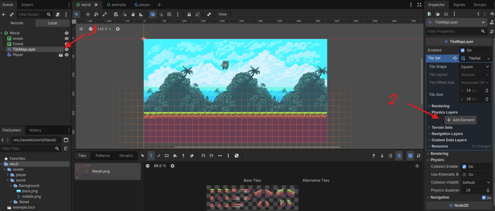
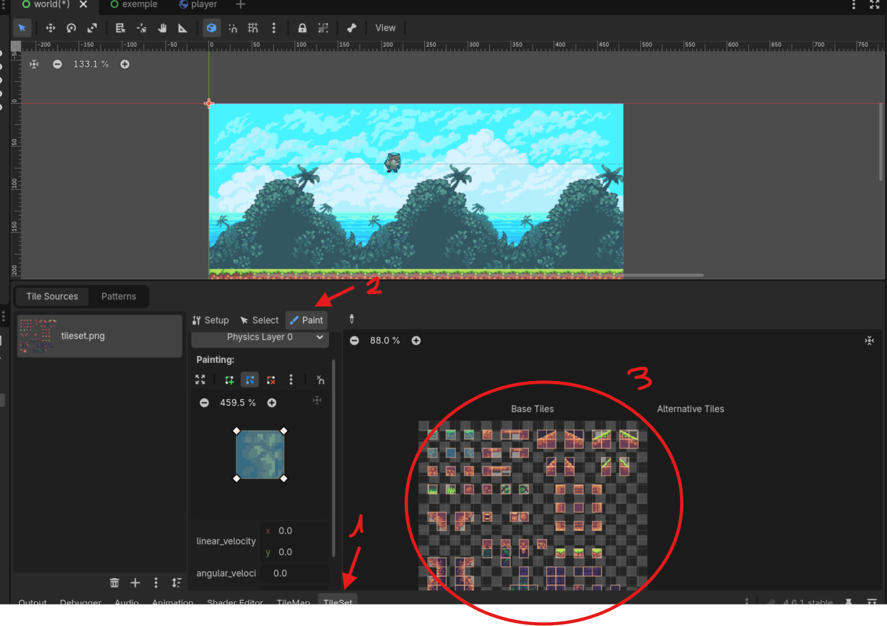

Ajout des physiques : 
~~~~~~~~~~~~~~~~~~~~~~~~~~~~~~~~~~~~~~~

On retourne donc sur la scène monde !

Pour l'instant ce n'est pas fou puisque notre joueur tombe dans le vide à l'infini sans opportunité de retour...

On peut facilement régler ce petit problème en ajoutant de la physique à notre monde !

Pour cela, sous l’onglet Physics layers du TileSet, cliquez sur le bouton Add Element. Cela va ajouter un nouveau Physics layer (une couche de physique si vous voulez).

L'onglet ``Paint`` est utilisé pour ajouter des propriétés aux tiles que l’on utilise. 
Ici, on va donc ajouter la propriété d’appartenance au ``Physics Layer 0``, afin d’avoir une collision.

Après avoir sélectionné la propriété, cliquez sur toutes les tiles juste à droite. 
En cliquant sur une tile, vous appliquez la propriété ``Physics Layer 0`` dessus (d’où le nom de l’onglet ``Paint``).

Les tiles devraient devenir bleues, ce qui signifie que vous venez de leur ajouter une hitbox.

Vous pouvez rester appuyé et glisser la souris pour aller plus rapidement.

A présent si nous relançons la scène, le joueur ne tombe plus dans le vide infini ! Et on peut même le controler et s'amuser à sauter avec !

Notre joueur est quand même un peu statique, et si nous ajoutions des animations ?