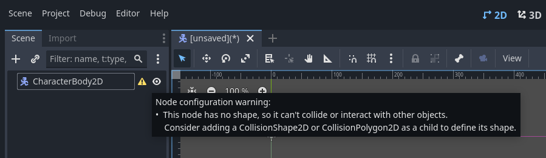
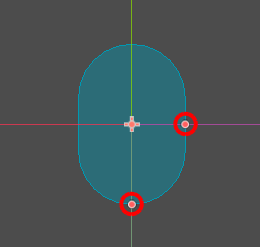
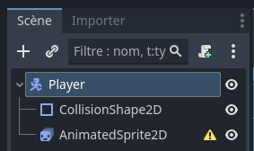
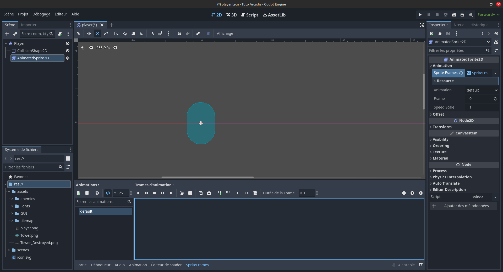
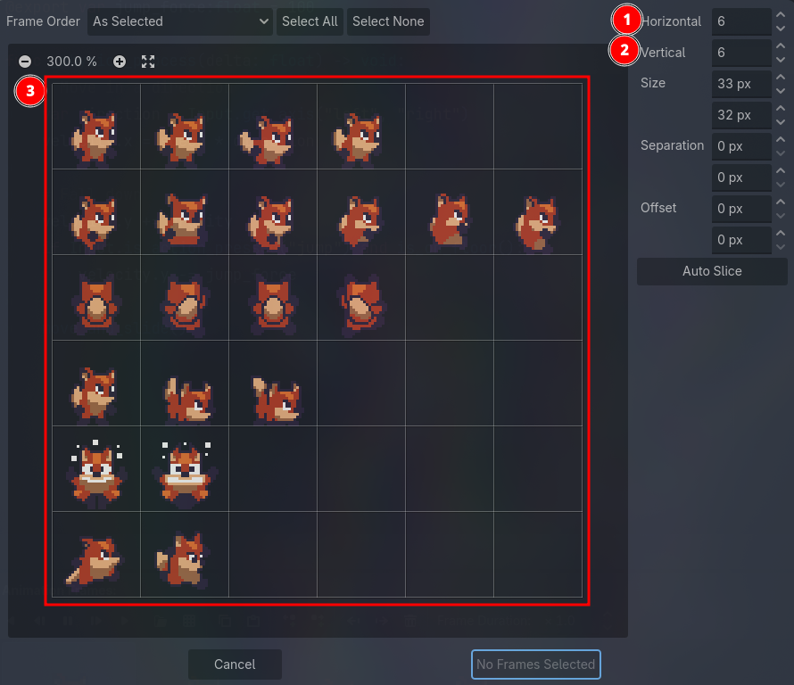
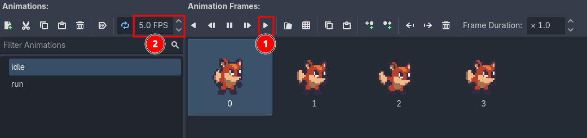
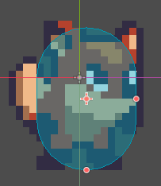
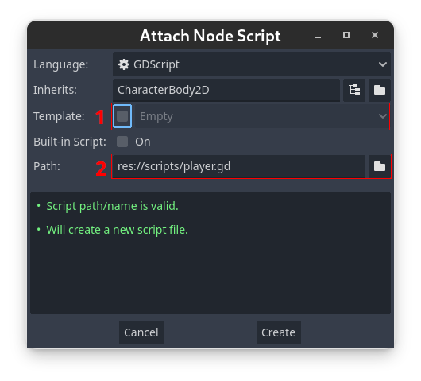
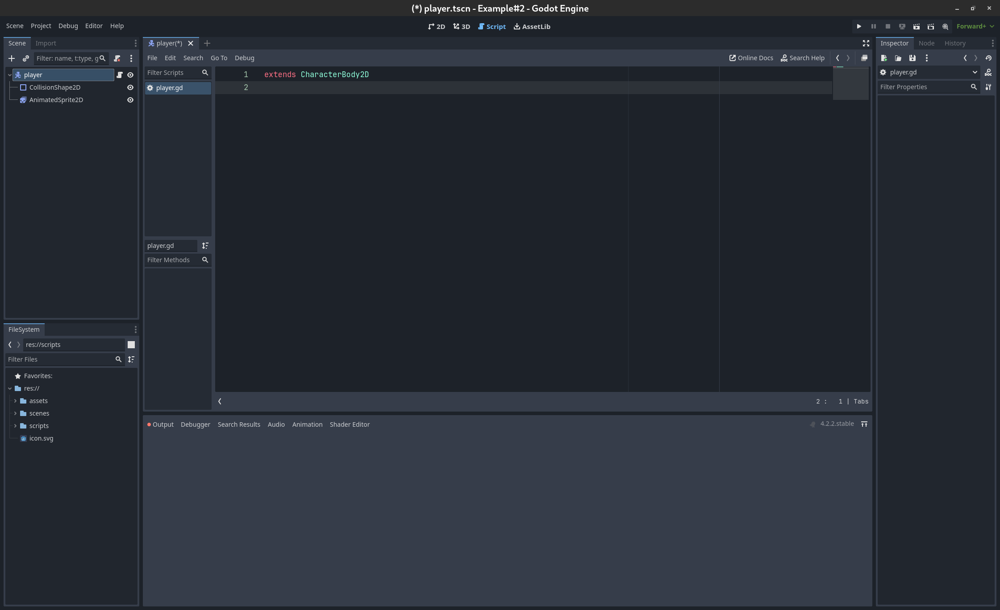

Création du Joueur
==================

On a un monde, mais pas de joueur pour le traverser !
Dans cette partie du tutoriel, nous allons créer un joueur, lui ajouter des animations, et des mouvements basiques.

.. _init-joueur:

Initialisation du Joueur
------------------------

Pour commencer, nous allons créer un ``CharacterBody2D``. C'est un nœud 2D, qui est utilisé pour créer des personnages qui peuvent se déplacer.
En haut à gauche, de la fenêtre principale de l'éditeur, créez une nouvelle scène en cliquant sur le bouton **+**, ou en appuyant sur ``Ctrl + N``. Celà créera un nouvel onglet, dans laquelle nous pourrons créer notre joueur. Pour celà, ajoutez un ``CharacterBody2D`` en cliquant sur le bouton ``Other Node`` dans l'arborescence, ou en appuyant sur ``Ctrl + A``.
Le noeud CharacterBody2D devrait apparaître dans l'arborescence, et l'éditeur devrait être passé en mode 2D.
Avant toute chose, sauvegardez votre nouvelle scène en appuyant sur ``Ctrl+S``.
Vous pouvez créer un dossier ``scenes`` dans votre projet, et y enregistrer la scène du joueur en l'appellant ``player.tscn``.

À droite du ``CharacterBody2D``, vous devriez appercevoir une icône de warning. Si vous placez votre souris dessus, vous verrez le message suivant:

.. warning::
   *  *"Ce nœud n'a pas de forme, il ne peut donc pas entrer en collision ou interagir avec d'autres objets.
      Envisagez d'ajouter un* ``CollisionShape2D`` *ou un* ``CollisionPolygon2D`` *en tant qu'enfant pour définir sa forme."*

Qu'il en soit ainsi, ajoutons un ``CollisionShape2D`` en cliquant sur l'icône **+** en haut à gauche, en appuyant sur ``Ctrl+A`` ou encore en faisant: **Clic-droit -> Ajouter un nœud** sur le ``CharacterBody2D``.

Le nœud ``CollisionShape2D`` est utilisé pour ajouter des hitbox (boîtes de collision). C'est la chose qui permettra à notre joueur d'interagir physiquement avec le monde autour de lui.
Après avoir ajouté la CollisionShape2D, vous devriez avoir un autre warning disant que celle-ci n'a pas de forme.

Pour ajouter une shape, cliquez sur le nœud CollisionShape2D. Vous verrez alors que l'inspecteur, à droite de l'écran, affiche des informations sur la CollisionShape2D.
Ajoutez une ``CapsuleShape2D`` dans l'attribut ``shape``, qui est normalement vide. Vous devriez voir un espèce de Tic Tac™ bleu au milieu de votre écran, c'est la shape que vous venez d'ajouter:

Vous pouvez changer sa taille avec les petits cercles oranges, mais on fera ça un tout petit peu plus tard.

.. _init-anims:

Création d'animations
---------------------

À présent, nous avons un joueur constitué d'un ``CharacterBody2D`` et d'une ``CollisionShape2D``. Il nous manque du visuel!
Nous allons donc ajouter un sprite à notre joueur.

.. note::
   Un *sprite*, c'est tout simplement une texture 2D, utilisée pour représenter un personnage, un décor, bref à peu près tout ce que vous voyez à l'écran dans un jeu 2D.

On veut que notre joueur ait des animations, donc ajoutez un nœud ``AnimatedSprite2D`` au joueur.

Faites attention à ce que le nœud soit un enfant du ``CharacterBody2D``, et non de la ``CollisionShape2D``. En effet, on ne veut pas ajouter un sprite à notre collision, on veut ajouter un sprite à notre joueur.
Si le nœud est mal placé dans l'arborescence, vous pouvez le drag-n-drop (restez appuyé sur le nœud et glissez-le) sur le nœud joueur.

Vous pouvez aussi renommer le nœud du joueur en ``"Player"``. Après ça, vous devriez avoir une arborescence comme ça:

Encore un warning! Cette fois-ci sur l'``AnimatedSprite2D``. Ajoutez donc un ``SpriteFrames``, comme le recommande le warning.

.. tip::
   Pour ajouter un nouveau ``SpriteFrames``, cliquez d'abord sur l'AnimatedSprite2D dans l'arborescence.
   Vous aurez alors accès aux propriétés du nœud dans l'inspecteur, qui se trouve à droite de votre fenêtre.

Après avoir ajouté un nouveau SpriteFrames, une nouvelle fenêtre devrait apparaître en bas de votre écran.
Si ce n'est pas le cas, cliquez sur le ``SpriteFrames`` que vous venez de créer dans l'inspecteur.

Cette fenêtre est l'éditeur d'animations. Vous pouvez la fermer et la réouvrir en cliquant sur *SpriteFrames* en bas de l'écran.
À gauche, vous trouverez une liste de toutes les animations disponibles. Pour l'instant, il n'y en a qu'une, elle s'appelle ``"default"``.
Renommez-la ``"idle"``.

.. note::
   Une animation d'idle, c'est l'animation qui se joue quand le personnage ne bouge pas.
   Généralement, elle représente le personnage qui respire, qui regarde un peu atour de lui, pour ajouter du mouvement à l'image et pour faire vivre le jeu.
   Dans certains jeux, si vous attendez suffisamment longtemps, des animations spéciales vont se jouer: le personnage qui se gratte la tête, qui s'assied par terre ou s'endort...

Cliquez ensuite sur l'icône de grille: *Add frames from sprite sheet*, et ouvrez le fichier ``assets/player/player.png``.

.. note::
   Une spritesheet est un fichier image qui contient toutes les frame d'animation d'un objet.
   Cela permet de n'avoir qu'un fichier, au lieu de plusieurs, ce qui économise de la place et facilite l'édition des animations.

Cela vous ouvrira le *Spritesheet Cutter*, qui ressemblera à ça:

La spritesheet forme une grille où chaque frame de l'animation se trouve dans une case.
Vous pouvez alors mettre le nombre de frames par colonne **[1]** et le nombre de frames par ligne **[2]**. Pour nous, on a 6 colonnes et 8 lignes.

Une fois les frames alignées avec la grille **[3]**, vous pouvez séléctionner les 6 premières frames (toute la première ligne), en cliquant dessus dans l'ordre ou en restant appuyé.
Finalement, vous pouvez appuyer sur *Add 6 Frames* en bas, pour ajouter les frames à votre animation d'idle.
Vous devriez voir les frames sélectionnées apparaître dans l'éditeur en bas:

Maintenant, vous pouvez jouer l'animation, en appuyant sur **play** **[1]**,
et changer la vitesse de l'animation, en changeant ses **FPS** (Frames Per Second / Images par seconde) **[2]**.

Une animation d'idle c'est bien, mais, nous aimerions que notre joueur puisse bouger,
donc on va rajouter une animation de course.

Pour cela, appuyez sur **Add Animation**, en haut à gauche de la fenêtre `SpriteFrames`.
Renommez cette animation ``"run"``, et répétez les mêmes étapes que pour l'animation d'idle,
en sélectionnant les 6 frames suivantes (toute la deuxième ligne).

Pour plus de fluidité, vous pouvez mettre les deux animations à **8 FPS** (ou ajuster la vitesse à votre préférence).

Et finalement, vous pouvez ajuster la hitbox crée :ref:`précédemment <init-joueur>` à notre sprite.

.. tip::
   Pour ajuster la taille de la collision plus facilement, vous pouvez glisser la ``CollisionShape2D`` en dessous de l'``AnimatedSprite2D`` dans la scène.
   Les nœuds qui sont **en dessous** dans l'arborescence apparaîtront **au dessus** dans l'éditeur (car ils sont créés après, et sont donc rendus au dessus).
   Vous pouvez ensuite remettre la ``CollisionShape2D`` à sa place. Ce n'est pas très important, car elle ne sera pas visible une fois le jeu lancé.

.. note::
   Il est généralement préférable d'avoir une hitbox légèrement plus petite que le visuel du personnage.
   Cela évite des situations du type: *"Mais* **#@!$&** *j'aurais pas dû mourir là l'ennemi il m'a même pas touché c'est abusé ce jeu est trop nul!"*

.. _move-init:

Création des mouvements
-----------------------

Actuellement nous avons un joueur, qui a des animations, mais qui ne fait pas grand chose.
Si vous lancez la scène avec **F6** ou en cliquant sur **l'icône de Clap avec un petit triangle** en haut à droite, vous verrez votre joueur dans un coin de l'écran qui ne peut pas se déplacer.
Dans cette partie, nous allons lui ajouter des mouvements rudimentaires.

Création du script
~~~~~~~~~~~~~~~~~~

Pour ce faire, nous allons devoir utiliser des bouts de code.
Premièrement, nous allons rattacher un script au Joueur, en séléctionnant le ``CharacterBody2D`` dans la hiérarchie,
et en cliquant sur **l'icône en forme de parchemin**: `Attach a new or existing script to the selected node` en haut de la fenêtre hiérarchie
(ou **Clic-droit -> Attach Script**).

Ce pop-up s'ouvrira alors:

Il vous faudra:

1. Décocher la case template
2. Renseigner l'endroit où votre script sera stocké. Créez un dossier ``"scripts"`` et mettez-y le script ``"player.gd"`` comme dans l'exemple.

Validez, et votre éditeur changera en mode **Script** pour ouvrir le fichier créé:

Initiation au GDScript
~~~~~~~~~~~~~~~~~~~~~~

Le fichier créé est en GDScript, le langage de script utilisé par Godot.
Ce langage est très similaire à Python, donc si vous avez un peu d'expérience en Python,
vous devriez être plutôt à l'aise en GDScript.

Nous allons voir ici les éléments essentiels de ce langage: les **variables** et les **fonctions**

**Les variables :**

Pour créer une variable, il faut écrire:

.. code-block:: gdscript

   var nom_variable = valeur

En GDScript, les variables ne sont pas typées, c'est-à-dire qu'elles peuvent changer de type, comme en Python.
Par exemple, on peut écrire:

.. code:: gdscript

    var x = 1 # x est de type int (entier)
    x = "hello" # x est un string (chaîne de caractère)

Il est préférable de typer ses variables, pour plusieurs raisons:

- Éviter les erreurs de type (ne pas faire n'importe quoi avec nos variables, comme dans l'exemple précédent)
- Donner une indication du type de notre variable à notre éditeur, pour qu'il nous suggère des informations pertinentes
- Optimiser le code (un code avec des variables typées sera normalement plus rapide qu'un code sans typage)

La syntaxe est la suivante:

.. code-block:: gdscript

    var nom:type = valeur
    # Exemples
    var x: int = 1
    var y: String = "hello"
    x = "bonjour" # Erreur, on ne peut pas assigner une valeur de type "String" à un "int".

Finalement, vous pouvez *"exporter"* vos variables,
pour faire en sorte qu'elles soient modifiables depuis l'Inspecteur, en mettant ``@export`` devant:

.. code-block:: gdscript

   @export var nom_variable:type = valeur

.. warning::
   Attention, vous ne pouvez pas *exporter* des variables définies dans des fonctions

**Les fonctions**

Pour créer une fonction, il faut écrire:

.. code-block:: gdscript

    func nom_fonction(var1, var2, ...):
        # ...
        return var3

Cette syntaxe est très similaire à celle de Python.
Si vous voulez spécifier les types de vos fonctions, vous pouvez faire:

.. code-block:: gdscript

    func nom_fonction(var1:type1, var2:type2, ...)->typeRetour:
        # ...
        return var3 # var3 est donc de type typeRetour
        # Si vous voulez ne rien retourner, mettez void à la place de typeRetour
        # Vous pouvez alors ne pas mettre de return, ou juste "return" sans rien après

Vous allez parfois utiliser des fonctions prédéfinies, comme ``_ready()`` ou ``_physics_process(delta)``,
ce sont des fonctions qui sont utilisées par Godot, et qui sont appelées à des moments précis.
Ce sont ces fonctions qui vont vous permettre de faire exécuter un bout de code, à un moment précis.
Par exemple:

- La fonction ``_ready`` est appelée une unique fois lorsque votre objet est ajouté dans votre jeu
- La fonction ``_physics_process(delta)`` est appelée à chaque fois que Godot refait les calculs de physique (de base: 60 fois par secondes, peu importe le framerate actuel).
  Le paramètre ``delta`` représente la durée (en secondes) depuis le dernier appel.
- La fonction ``_process(delta)`` est appelée à chaque frame (différent de ``_physics_process``, car dépend du framerate).
  Le paramètre ``delta`` représente la durée (en secondes) depuis le dernier appel (depuis la dernière frame).

Implémentation mouvements rudimentaires
~~~~~~~~~~~~~~~~~~~~~~~~~~~~~~~~~~~~~~~

Concrètement, pour bouger notre joueur, il nous faut plusieurs choses:

1. Détecter à chaque update de la physique, où le joueur veut bouger
2. Modifier la vélocité du joueur
3. Faire bouger le joueur, et gérer les collisions avec les autres éléments

Pour celà, nous pouvons utiliser le code suivant:

.. code-block:: GDScript

   func _physics_process(delta):
       var directionX:int = Input.get_axis("ui_left", "ui_right")
       velocity.x = directionX * 200
       move_and_slide()

Ce code est dans la fonction ``_physics_process`` et s'exécutera donc à chaque update du moteur physique.
À chaque appel, nous initions une variable direction, qui va prendre comme valeur, la valeur de retour de ``Input.get_axis("ui_left", "ui_right")``

``Input.get_axis(input1, input2)`` est une fonction qui va prendre deux inputs, et qui va "simuler" un joystick entre les deux, et dire où ce joystick est.
Si le joystick est à gauche, donc que input1 est appuyé, la fonction renverra -1,
si le joystick est à droite, elle renverra 1,
sinon, elle renverra 0 (si vous jouez au joystick, vous pourrez avoir toutes les valeurs entre -1 et 1, mais si vous jouez au clavier, vous n'aurez que les valeurs entières).

Ensuite, après avoir récupéré la direction du joueur sur l'axe X,
nous allons pouvoir changer la vélocité du joueur sur l'axe X,
en multipliant la direction par `300`, `300` étant la vitesse que l'on donnera à notre joueur.

Finalement, nous travaillons avec un ``CharacterBody2D``, et donc nous avons accès à la fonction ``move_and_slide()``,
qui va automatiquement faire bouger le joueur, et gérer ses collisions.

Pour tester ce code, vous pouvez appuyer sur ``F6`` (ou sur ``fn+F6``) pour faire tourner la scène actuelle.

Implémentation du saut
~~~~~~~~~~~~~~~~~~~~~~

Bon, c'est bien, mais dans un platformer, il faut que notre joueur:
1. Tombe
2. Puisse sauter lorsqu'il est sur le sol

Pour faire tomber le joueur, on peut juste le faire accélerer vers le bas à chaque update du moteur physique.
Pour celà, on peut rajouter cette ligne au ``_physics_process``:

.. code-block:: GDScript

    func _physics_process(delta):
        ...
        velocity.y += delta * 100

Et pour le faire sauter, il faut détécter lorsque le joueur est *sur le sol* et qu'il *appuie sur espace*.
Pour celà, on utilisera une condition, donc un bloc ``if``. Et lorsque ce bloc est vrai, on mets la velocité y à la valeur de notre saut (75 dans notre cas).

.. code-block:: GDScript

    func _physics_process(delta):
        ...
        if Input.is_action_just_pressed("ui_accept") and is_on_ground():
            velocity.y = -75

.. _anims-fin:

Ajout du joueur au monde 
~~~~~~~~~~~~~~~~~~~~~~~~~~~~~~~~~~~~~~~

On peut désormer ajouter notre joueur à notre monde.

Pour cela retournez tout d'abord sur la scène `World` que vous avez créer. Vous pouvez alors ajouter le joueur à l'aide à l'aide du boutton en haut à gauche juste à côté du plus.

.. image:: img/addPlayerToScene.png

On peut même lancer la scène et voir que notre joueur... tombe dans le vide. Ah !
C'est parfaitement normal ! Nous avons ajouté le visuel du côté monde et la physique du côté joueur mais nous n'avons toujours pas ajouté la physique du côté du monde il nous faut ajouter la physique. Ce que l'on fera dans la partie suivante !

