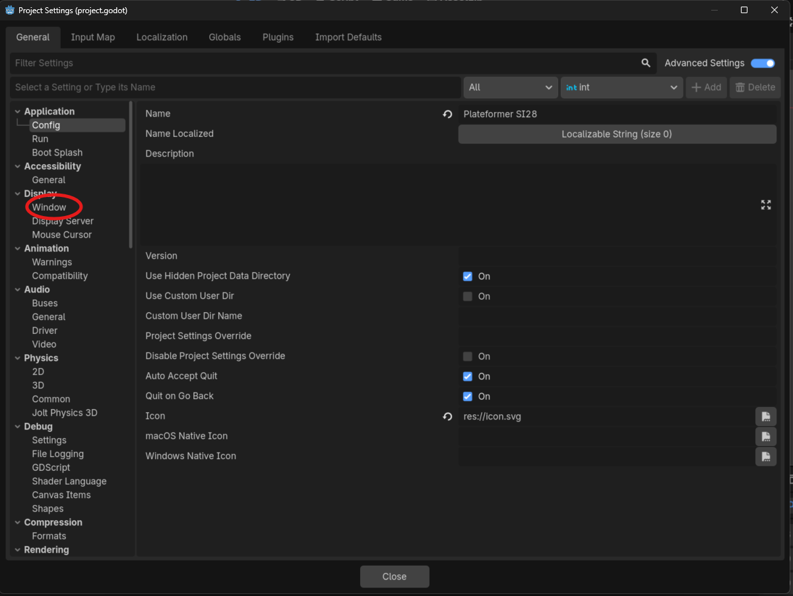
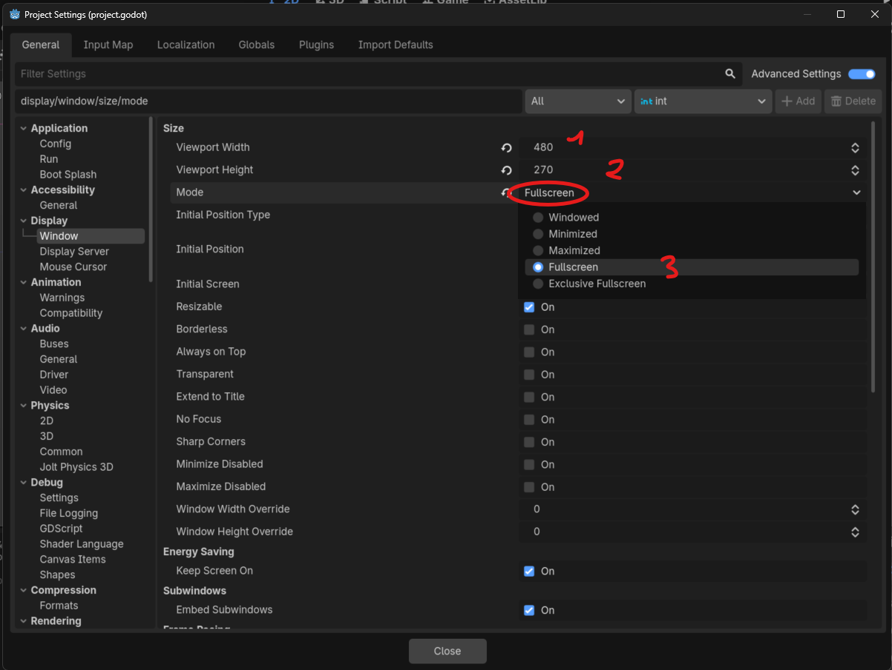
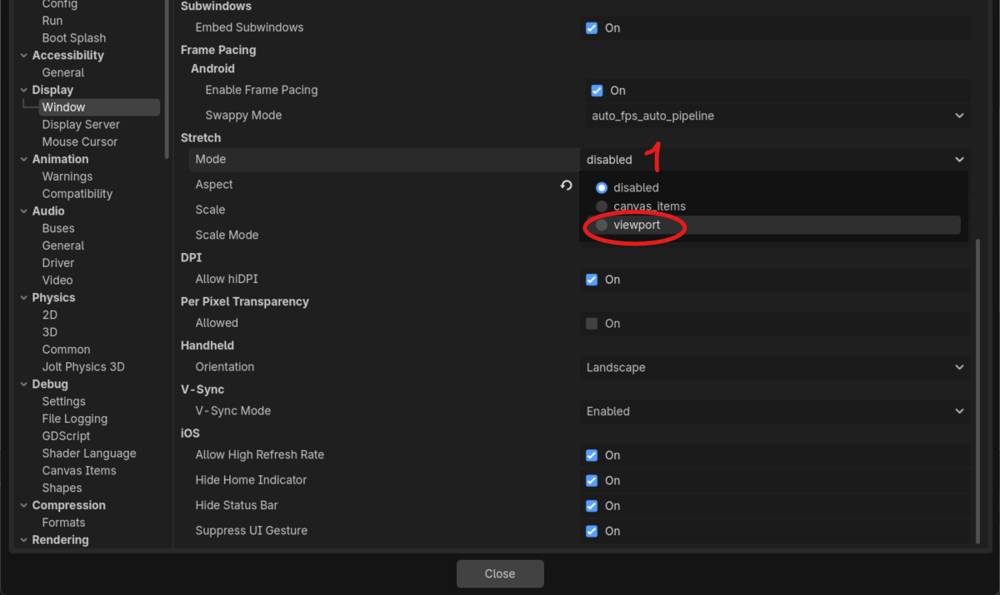
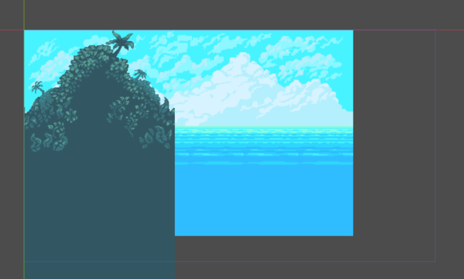
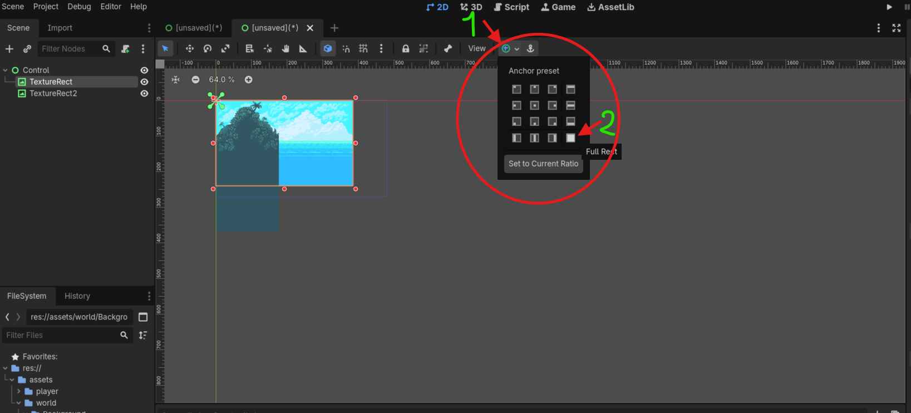
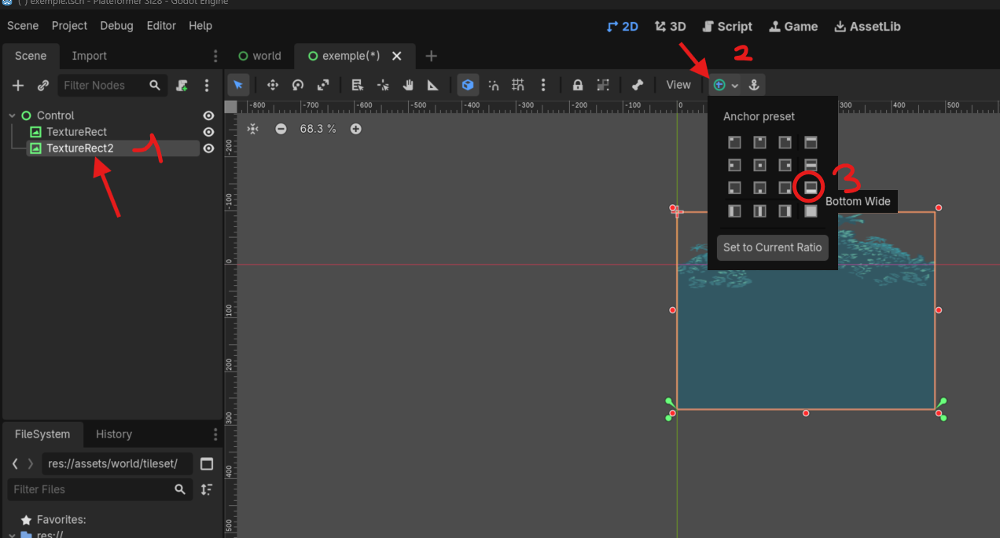
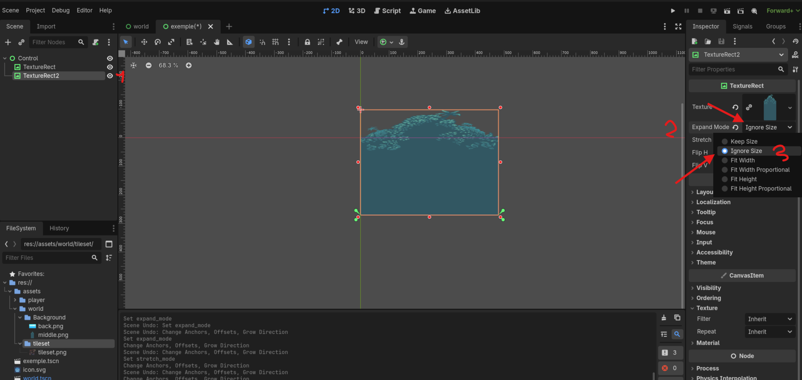
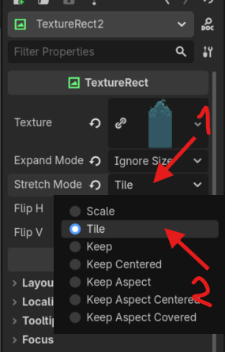
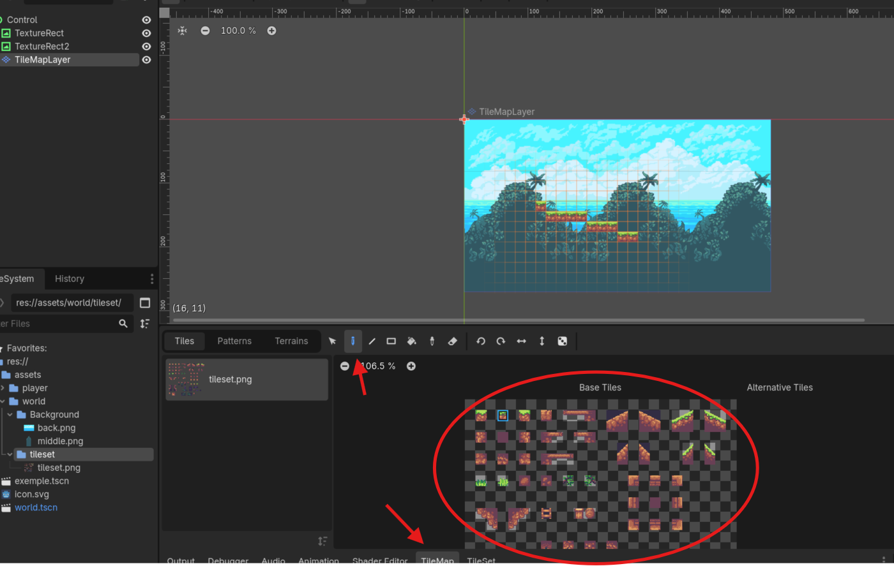
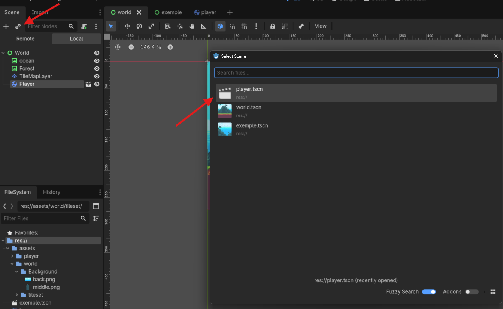

Création du monde
=================

Initialisation du monde
-----------------------

Nous allons essayer de créer un monde qui ressemble à ça : 

.. image:: img/ObjectifWorld.png

Dans le cadre de ce tutoriel nous travaillons avec des sprites (des dessins) qui sont de tailles 16 par 16. Cependant la résolution par défaut de godot (1152 par 648) est beaucoup trop grande pour ce type de sprite.
Dans la résolution par défaut de Godot, notre joueur ferait cette taille : 

.. image:: img/contreExempleResolution.png

**Ce que vous conviendrait est un peu petit**.

Pour changer la résolution dans Godot, il suffit d'aller la modifier dans les paramètres du projet. Vous pouvez donc cliquez en haut à gauche sur ``Project`` puis sur projet settings.

.. image:: img/ProjectSettings.png

Vous allez voir une fenêtre qui ressemble à ça. Ne vous inquiétez pas, même s'il semble il y avoir beaucoup de choses, nous n'allons quasiment touché à rien.
Les paramètres de résolutions se situent dans l'onglet ``Window``.

Dans l'onglet window modifier le viewport width à 480, le viewport height à 270 (on aura donc une résolution 480 par 270 !) et le Mode à ``Fullscreen`` pour que le jeu s'ouvre automatiquement en pleine écran.

La dernière petite option qu'on va modifier c'est le stretch mode qui va permettre à notre petit jeu de résolution 480 par 270 de recouvrir tout l'écran.
Pour trouver le Stretch Mode, il suffit de descendre un peu plus bas dans l'onglet Window dans la partie ``Strech `` où on peut voir une option `Mode`. On va choisir l'option ``Viewport``.

Maintenant qu'on a mis en place tout cela, on peut quitter les paramètres du projet et revenir à la création de notre monde !
Pour ce faire, on va commencer par créer une nouvelle scène qui sera notre `Monde`.
Cliquez sur **Scene -> New Scene** en haut à droite, ou sur le petit **+** en haut à côté de l'onglet de la scène ``player``, ou appuyez sur ``Ctrl+N``.
Une nouvelle scène vierge devrait s'ouvir:

.. image:: img/WorldCreation.png

Ici, nous allons créer un ``Control Node``, c'est un type de Node qui permet de gérer l'agencement de ses enfants. Pour ça, appuyez à nouveau sur le **+** et rechercher la node ``Control`` ou plus directement  appuyez sur le boutton  ``User Interface`` dans la hiérarchie (à gauche).
Vous pouvez d'ores et déjà renommer ce noeud en ``"World"``.

Avant de faire quoi que ce soit apprenons d'abord apprendre à lancer une scène et à définir une scène principale. Commencez par appuyer sur ``F5``. Cela va vous afficher une petite pop-up qui ressemble à ça : 

.. image:: setupMainScene.png

Cliquez sur ``Select Current `` ce qui va vous permettre de définir cette scène comme la scène principale ! A présent à chaque fois que nous appuyerons sur ``F5``, Godot lancera cette scène. Nous aurions pu aussi appuyer sur ``F6`` pour lancer la scène courante (qui dans notre cas aurait donné le même résultat) ou encore utiliser les bouttons en haut à droite indiqués sur l'image.

Malheureusement pour l'instant notre scène ne contient rien. Simplement un néant gris un peu moche ! Mais ne vous inquiétez pas nous allons bientot là remplir.

Commençons par ajouter deux noeuds ``TextureRect`` en tant qu'enfant du ``Control Node``. Les ``TextureRect`` vont ici servir à créer le fond.

Vous pouvez cliquer sur chacun d'entre eux pour afficher leur propriété dans l'inspecteur à gauche. Nous allons ajouter dans leur propriété ``Texture`` les images disponibles dans Backround, respectivement ``back.png`` and ``middle.png``. 
Vous pouvez les ``load`` en cliquant sur la petite flèche à côté de la propriété texture ou bien directement les glisser depuis les dossiers en bas à gauche.

.. image:: img/loadTexture.png

C'est bien beau tout ça mais sauf qu'après avoir load les deux textures, notre scène ressemble à ça : 

Ce qui ne correspond pas à ce que l'on veut. Heureusement, on peut faciliment régler ça ! Premier point, l'océan ne couvre pas tout l'écran, on peut arranger ça en cliquant sur le ``TextureRect`` qui a la texture d'océan et en changeant son anchor mode à Full Rect (on lui dit de prendre toute la place disponible sur l'écran).

Ensuite nous aimerions que le feuillage soit en bas de l'écran et recouvre toute la longueur, nous pouvons donc utilisons l'anchor ``bottom wide`` correspondant.

Néanmoins nous voyons bien que la texture ne réagit pas comme nous le désirons et qu'elle reste trop large. Et même si nous essayons de la resize verticalement manuellement avec la souris, la texture refuse de coopérer.
C'est ainsi car par défaut l'expand mode (c'est à dire comment leur taille est gérée) des textures dans godot  est défini à `keep_size`. Avec cette option il n'est pas possible de donner à une texture, une largeur ou longueur inférieure à celle de base.
Heureusement, nous pouvons facilement changer ça en changeant l'expand mode à `Ignore Size` ce qui vous permet de redimensionner la texture avec la souris.

A présent nous pouvons resize la texture comme nous le désirons. Cependant, lorsque nous l'élargissons la texture, nous constatons tout de même qu'elle devient distordue. Nous aimerions plutôt essayer de recréer une sorte de patterne comme sur la photo originale avec les feuillages en fond. Pour ça, nous pourrions copier-coller, et resize les textures une par une  mais en réalité il existe une solution bien plus facile et bien plus élégante sur Godot.

Il suffit de changer le stretch Mode de la texture à Tile à la place de Scale. Ceci va indiquer à godot que notre Texture fait partie d'un motif et qu'on souhaite qu'elle soit répétée lorsqu'on l'aggrandit.

Maintenant que nous avons mis en place le fond. Nous aimerions pouvoir "dessiner" sur ce fond. Pour cela nous allons utiliser un ``TileMapLayer``.

.. warning::
  Depuis la version 4.3 de Godot, le nœud ``TileMap``, qui était jusque là utilisé, n'est plus d'actualité!
  Le fonctionnement est globalement similaire, mais faites bien attention à prendre un nœud ``TileMapLayer``.

.. note::
  Une tilemap sectionne le monde en une grille. Les cases de cette grille sont remplies avec des blocs que vous placez afin de construire le monde.
  Cette technique est très répandue dans les jeux 2D. Si vous avez joué à Mario Maker, concrètement, lorsque vous crééz un niveau, vous manipulez une tilemap.

Il s'agit de créer le monde en collant les uns aux autres des petits blocs de terrain, appelés `tiles`.
Ça permet non seulement de simplifier la création de niveau, mais ça permet également d'optimiser le jeu.

Customisation du TileMapLayer
-----------------------------

Nous venons de créer un ``TileMapLayer``, mais il ne contient pas encore de `tiles` à placer dans notre monde.
Pour ça, on va créer un ``TileSet``.

.. note::
  Un tileset, c'est un peu comme une palette en peinture.
  C'est là que seront stockés tous les blocs avec lesquels on va "peindre" notre monde.
  Le tileset contient non seulement les informations visuelles (à quoi ressemble le bloc), mais d'autres informations comme, par exemple, des informations sur la collision du bloc.

Pour ajouter un ``TileSet`` au ``TileMapLayer``, cliquez sur **Tileset -> New Tileset** dans l'Inspecteur.
Les onglets **TileSet** et **TileMap** devraient alors s'être ouverts dans la fenêtre du bas de l'éditeur.
Cliquez sur l'onglet **TileSet**:

.. image:: img/tilesetEmpty.png

Appuyez sur le bouton **+** **[1]**, cliquez sur **Atlas**, puis séléctionnez le fichier ``assets/tileset/tileset.png``.
Godot va alors vous demander si vous voulez créer automatiquement des tiles dans l'Atlas.
Séléctionnez oui, et vous verrez une grille découper l'image en blocs de 16px par 16px, ce qui est parfait pour nos cases à nous !
Cependant, si nous avions voulu des cases 32px par 32 px, il aurait fallu modifier cette option (la taille dépend de votre tileset, mais celui-ci a été dessiné pour des casses de 16*16).

Maintenant que vous avez créé votre tileset, vous pouvez aller dans l'onglet **TileMap**, pour "peindre" le monde.
Pour cela, il suffit de cliquer sur le bloc que vous voulez placer, et "peindre" votre monde dans l'éditeur.

.. Note Jules: Tout "corrigé" jusque là
.. + pour faire des titres, il faut les souligner entièrement, sinon ça fait des warning

On peut désormer ajouter notre joueur à notre scène à l'aide du boutton en haut à gauche juste à côté du plus.

