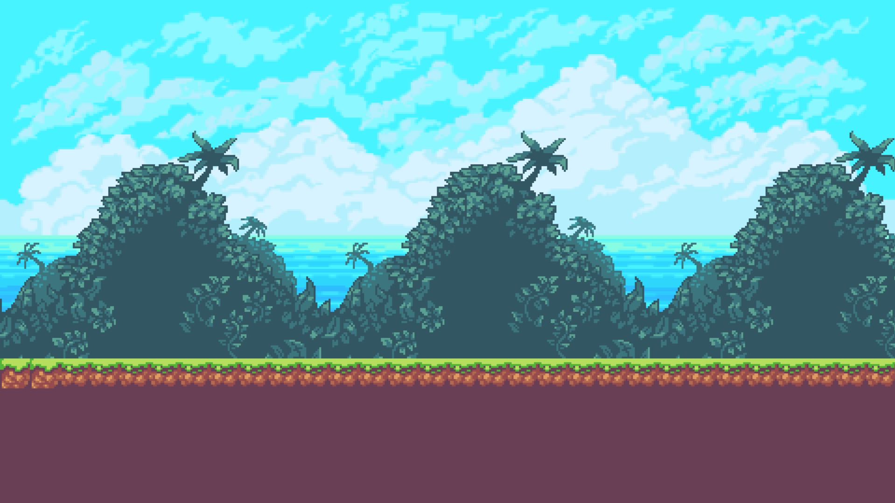
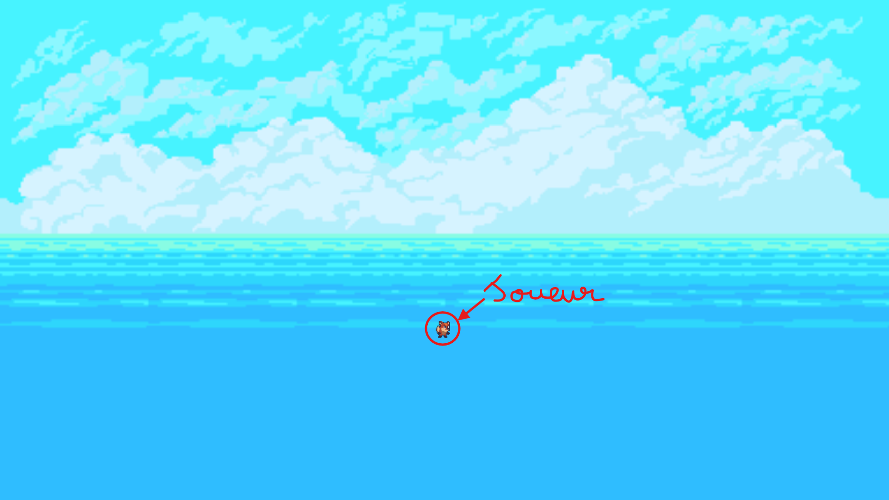
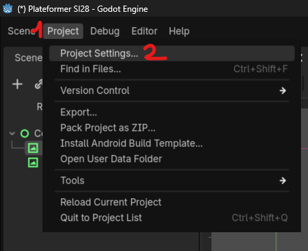
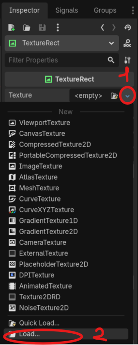

Création du monde
=================

Initialisation du monde
-----------------------

Actuellement, on a un joueur, mais on n'a pas le monde dans lequel ce joueur doit se déplacer. Nous allons essayer dans le cadre de ce tutoriel de créer un monde qui ressemble à ça : 

Dans le cadre de ce tutoriel nous travaillons avec des sprites (des dessins) qui sont de tailles 16 par 16. Cependant la résolution par défaut de godot (1152 par 648) est beaucoup trop grande pour ce type de sprite.
Dans la résolution par défaut de Godot, notre joueur ferait cette taille : 

**Ce que vous conviendrait est un peu petit*.

Pour changer la résolution dans Godot, il suffit d'aller la modifier dans les paramètres du projet. Vous pouvez donc cliquez en haut à gauche sur ``Project`` puis sur projet settings.

Vous allez voir une fenêtre qui ressemble à ça. Ne vous inquiétez pas, même s'il semble il y avoir beaucoup de choses, nous n'allons quasiment touché à rien.
Les paramètres de résolutions se situent dans l'onglet ``Window``.

.. image:: changerResolution1.png

Dans l'onglet window modifier le viewport width à 480, le wiewport height à 270 (on aura donc une résolution 480 par 270 !) et e Mode à ``Fullscreen`` pour que le jeu s'ouvre automatiquement en pleine écran.

.. image:: changerResolution2.png

La dernière petite option qu'on va modifier c'est le stretch mode qui va permettre à notre petit jeu de résolution 480 par 270 de recouvrir tout l'écran.
Pour trouver le Stretch Mode, il suffit de descendre un peu plus bas dans l'onglet Window dans la partie ``Strech `` où on peut voir une option ``Mode``. On va choisir l'option ``Viewport``.

.. image:: changerResolution3.png

Maintenant qu'on a mis en place tout cela, on peut quitter les paramètres du projet et 
Pour ce faire, on va commencer par créer une nouvelle scène qui sera notre `Monde`.
Cliquez sur **Scene -> New Scene** en haut à droite, ou sur le petit **+** en haut à côté de l'onglet de la scène ``player``, ou appuyez sur ``Ctrl+N``.
Une nouvelle scène vierge devrait s'ouvir:

.. image:: img/WorldCreation.png

.. hint:: Si vous êtes restés dans l'éditeur de code, vous pouvez revenir à l'éditeur 2D,
  en cliquant sur le bouton ``2D``, en haut de la fenêtre.

Ici, nous allons créer un ``Control Node``, c'est un type de Node qui permet de gérer la disposition de ses enfants sur l'écran. Pour ça, appuyez à nouveau sur le **+** et rechercher la node ``Control`` ou plus directement sur le boutton  ``User Interface`` dans la hiérarchie (en haut à gauche).
Vous pouvez renommer ce noeud en ``"World"``, et lui ajouter deux noeuds ``TextureRect`` en enfant.

Vous pouvez cliquer sur chacun d'entre eux pour afficher leur propriété dans l'inspecteur à gauche. Nous allons ajouter dans leur propriété ``Texture`` les images disponibles dans Backround, respectivement ``back.png`` and ``middle.png``. 
Vous pouvez les ``load`` en cliquant sur la petite flèche à côté de la propriété texture ou bien directement les glisser depuis les dossiers en bas à gauche.

.. warning::
  Depuis la version 4.3 de Godot, le nœud ``TileMap``, qui était jusque là utilisé, n'est plus d'actualité!
  Le fonctionnement est globalement similaire, mais faites bien attention à prendre un nœud ``TileMapLayer``.

.. note::
  Une tilemap sectionne le monde en une grille. Les cases de cette grille sont remplies avec des blocs que vous placez afin de construire le monde.
  Cette technique est très répandue dans les jeux 2D. Si vous avez joué à Mario Maker, concrètement, lorsque vous crééz un niveau, vous manipulez une tilemap.

Il s'agit de créer le monde en collant les uns aux autres des petits blocs de terrain, appelés `tiles`.
Ça permet non seulement de simplifier la création de niveau, mais ça permet également d'optimiser le jeu.

Customisation du TileMapLayer
-----------------------------

Nous venons de créer un ``TileMapLayer``, mais il ne contient pas encore de `tiles` à placer dans notre monde.
Pour ça, on va créer un ``TileSet``.

.. note::
  Un tileset, c'est un peu comme une palette en peinture.
  C'est là que seront stockés tous les blocs avec lesquels on va "peindre" notre monde.
  Le tileset contient non seulement les informations visuelles (à quoi ressemble le bloc), mais d'autres informations comme, par exemple, des informations sur la collision du bloc.

Pour ajouter un ``TileSet`` au ``TileMapLayer``, cliquez sur **Tileset -> New Tileset** dans l'Inspecteur.
Les onglets **TileSet** et **TileMap** devraient alors s'être ouverts dans la fenêtre du bas de l'éditeur.
Cliquez sur l'onglet **TileSet**:

.. image:: img/tilesetEmpty.png

Appuyez sur le bouton **+** **[1]**, cliquez sur **Atlas**, puis séléctionnez le fichier ``assets/tilemap/Tilemap_Flat.png``.
Godot va alors vous demander si vous voulez créer automatiquement des tiles dans l'Atlas.
Séléctionnez oui, et vous verrez une grille découper l'image en blocs de 16px par 16px, ce qui est parfait pour nos cases à nous (mais il faudrait changer )
Cependant, nous voulons des cases de 32px par 32px (la taille dépend de votre tileset, mais celui-ci a été dessiné pour des casses de 32*32).

Maintenant que vous avez créé votre tileset, vous pouvez aller dans l'onglet **TileMap**, pour "peindre" le monde.
Pour cela, il suffit de cliquer sur le bloc que vous voulez placer, et "peindre" votre monde dans l'éditeur.

.. Note Jules: Tout "corrigé" jusque là
.. + pour faire des titres, il faut les souligner entièrement, sinon ça fait des warning

Maintenant,

[temp]

- Ajout des murs
- Ajout du joueur dans ce monde